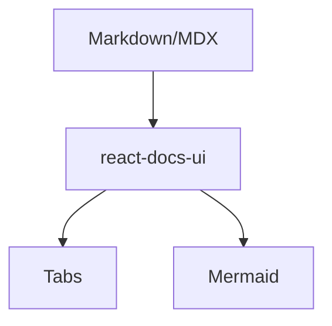
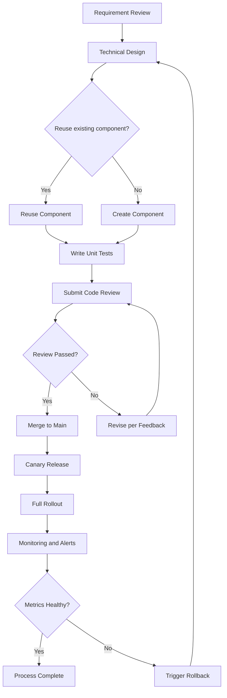
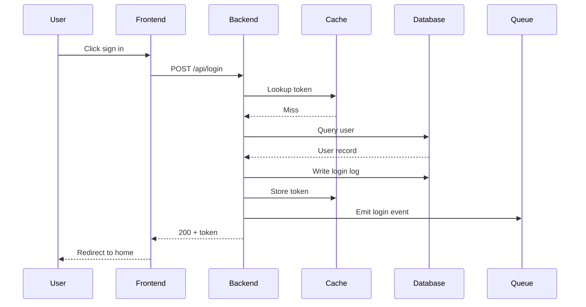

# MDX Component Usage Examples

This page demonstrates how to use custom React components in Markdown documents.

## Using Built-in Components

react-docs-ui provides the following built-in MDX components that can be used directly.

**Note**: Component names support both PascalCase (recommended) and lowercase. For example, both `<Tip>` and `<tip>` work correctly.

### Tip Component

Used to display tip information:

<Tip title="This is a tip">
    This is the content of a tip component. You can place important tips here.
</Tip>

### Warning Component

Used to display warning information:

<Warning title="This is a warning">
    This is the content of a warning component. Used to remind users of potential issues or risks.
</Warning>

### Card Component

Used to organize related content blocks:

<Card title="This is a card">
    This is the content of a card component. Cards can be used to organize related content blocks.
</Card>

### Tabs Component

<Tabs>
    <Tab title="pnpm">
        `pnpm dev`
    </Tab>
    <Tab title="npm">
        `npm run dev`
    </Tab>
</Tabs>

### Mermaid Diagram



When a diagram has many elements, it renders at its natural size with bidirectional scrolling inside a bounded height, so the text is never shrunk to an unreadable size. Click the fullscreen button in the top-right corner of a diagram to open the viewer: mouse-wheel zoom, drag to pan, a toolbar (zoom in / zoom out / fit / actual size / reset / download SVG / browser fullscreen), and keyboard shortcuts `+` `-` `0` `F`.

Below is a larger diagram you can use to try these interactions:



The same applies to sequence diagrams with many participants:



## Code Block Examples

You can use standard Markdown code block syntax in MDX:

```tsx
// This is a TypeScript code block example
function Greeting({ name }: { name: string }) {
    return <div>Hello, {name}!</div>;
}
```

```javascript
// This is a JavaScript code block example
function add(a, b) {
    return a + b;
}
```

## More Components

If you need more custom components, you can create React components in the `src/components` directory of your project. They will be automatically scanned and registered to the MDX context.
