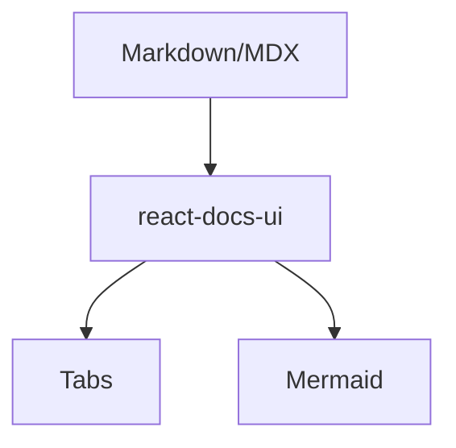
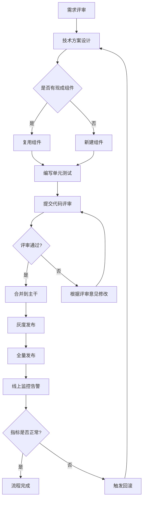
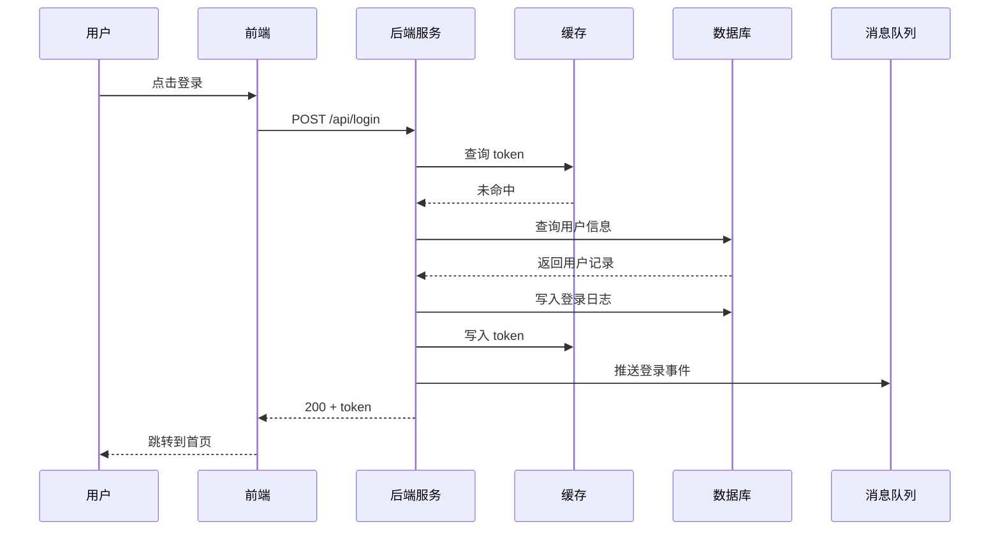

# MDX 组件使用示例

本页面演示了如何在 Markdown 文档中使用自定义 React 组件。

## 使用内置组件

react-docs-ui 提供了以下内置的 MDX 组件，可以直接使用。

**注意**：组件名称支持 PascalCase（推荐）和小写两种写法。例如，`<Tip>` 和 `<tip>` 都可以正常工作。

### Tip 组件

用于显示提示信息：

<Tip title="这是提示">
    这是一个提示组件的内容。你可以在这里放置重要的提示信息。
</Tip>

### Warning 组件

用于显示警告信息：

<Warning title="这是警告">
    这是一个警告组件的内容。用于提醒用户注意潜在的问题或风险。
</Warning>

### Card 组件

用于组织相关内容块：

<Card title="这是卡片">
    这是一个卡片组件的内容。卡片可以用来组织相关的内容块。
</Card>

### Tabs 组件

<Tabs>
    <Tab title="pnpm">
        `pnpm dev`
    </Tab>
    <Tab title="npm">
        `npm run dev`
    </Tab>
</Tabs>

### Mermaid 图表



当图表元素较多时，默认会以自然尺寸渲染并在有限高度内双向滚动，避免文字被压缩到看不清。点击图表右上角的「全屏」按钮，可以打开全屏查看器：支持滚轮缩放、按住拖拽平移、工具栏（放大 / 缩小 / 适配窗口 / 原始比例 / 重置 / 下载 SVG / 浏览器全屏），以及键盘快捷键 `+` `-` `0` `F`。

下方是一个节点较多的大图，可用于验证上述交互：



多参与者的时序图同样适用：



## 代码块示例

你可以在 MDX 中使用标准的 Markdown 代码块语法：

```tsx
// 这是一个 TypeScript 代码块示例
function Greeting({ name }: { name: string }) {
    return <div>Hello, {name}!</div>;
}
```

```javascript
// 这是一个 JavaScript 代码块示例
function add(a, b) {
    return a + b;
}
```

## 更多组件

如果需要更多自定义组件，可以在项目的 `src/components` 目录下创建 React 组件，它们会自动被扫描并注册到 MDX 上下文中。
